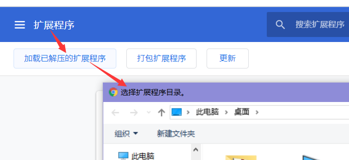
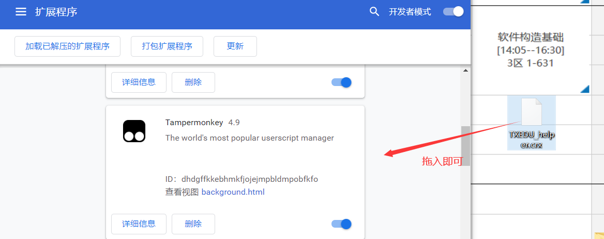
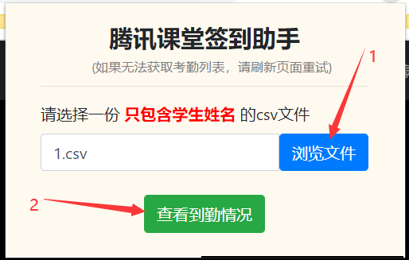

# 腾讯课堂签到助手

 

## 项目简介

帮助老师和课代表查看签到情况的Chrome扩展。

## 使用方法

- 首先点击右上角`:star2: Star`ʕ •ᴥ•ʔ
- 下载扩展并安装
  - 你可以直接`git clone git@github.com:Sh-Zh-7/TXEDU-helper.git`获得源代码，然后在chrome扩展里面加载整个文件夹。
  - 你也可以到该项目专门的`github`页面找[release](<https://github.com/Sh-Zh-7/TXEDU-helper/releases>), 找到最新最稳定的版本并下载，解压后直接拖入`chrome://extensions`里面就行了。
- 进入相应页面，在chrome浏览器右上角点击扩展，弹出交互页面。
- 上传只含学生姓名的csv文件，点击“查看签到情况按钮”， 就可以看到缺勤的名单了。

## FAQ

**Q1：** **明明腾讯课堂中老师可以发起签到，为什么还需要你这种扩展？**

**A1：** 主要考虑到以下几个方面：

1. **教师用腾讯课堂应该是没有选课名单的**。如果有同学逃课，或者有蹭课的点到签到。这时候教师获得的签到列表就混乱了。因此，一款配合选课学生名单的签到插件是有必要的。
2. **签到的学生可能有着多种多样的昵称**，比如“张三”，“1234张三”， “张三1234”。由此推断**教师即使获得了签到学生名单，最后还是要手动比对**。这个插件可以帮忙把选课名单上的姓名和上课名单上相同的昵称都去掉，让教师和课代表专注于拥有个性化昵称的学生。
3. **客户端的签到功能不合理。**在上课列表，但是没有点击签到按钮的，该怎么处理？造成这种现象的有很多种原因，比如在不同的客户端可能就根本无法正常显示签到按钮，或者因为签到的时间太短，恰好学生这时候有别的事情，错过了签到怎么办？

**Q2: 为什么是csv文件？.xlx， .xlsx怎么导出成.csv文件？**

**A2：**暂时还不支持其他的如.txt, .xlx, xlsx文件， 这个可能会在未来的版本添加。至于后一问：[传送门](https://support.office.com/zh-cn/article/%E5%AF%BC%E5%85%A5%E6%88%96%E5%AF%BC%E5%87%BA%E6%96%87%E6%9C%AC%EF%BC%88-txt-%E6%88%96-csv%EF%BC%89%E6%96%87%E4%BB%B6-5250ac4c-663c-47ce-937b-339e391393ba)

**Q3：** **为什么点击“查看签到情况按钮”没有反应？这时候该怎么做？**

**A3:** 在测试过程中偶尔有点击按钮没有反应的情况出现，但是都与实际应用的情况无关。**刷新页面**基本上就可以解决所有的问题。如果实在解决不了，带着你的截图来提issue。

**Q4：我既不是老师也不是课代表，如何体验你这款产品？**

**A4：** 自己试着写出一份选课名单（只要包含姓名即可，既然是体验就没必要涉及所有的学生），然后按照说明操作就行了。

## License

[MIT License](LICENSE)

Copyright (c) 2020 sh-zh-7